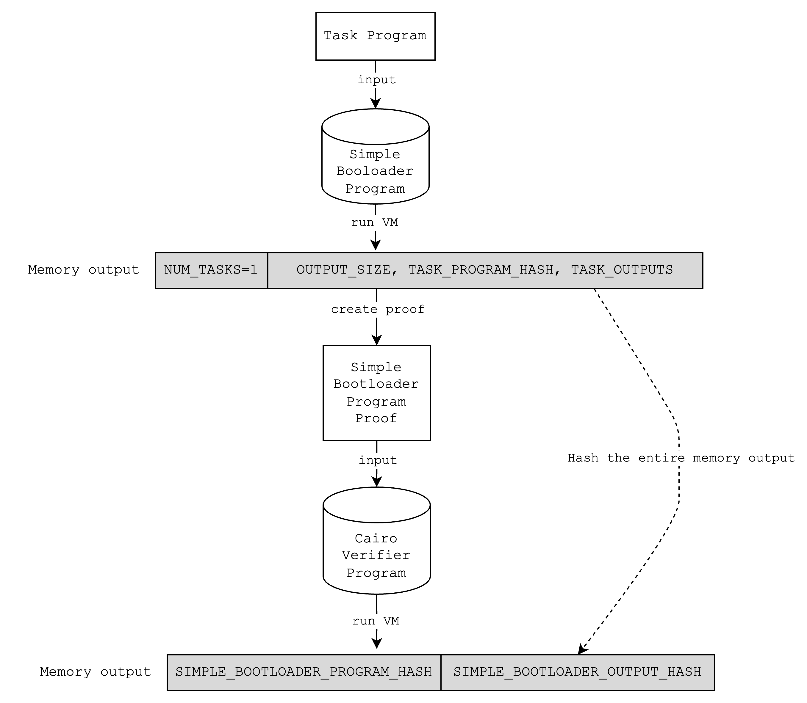
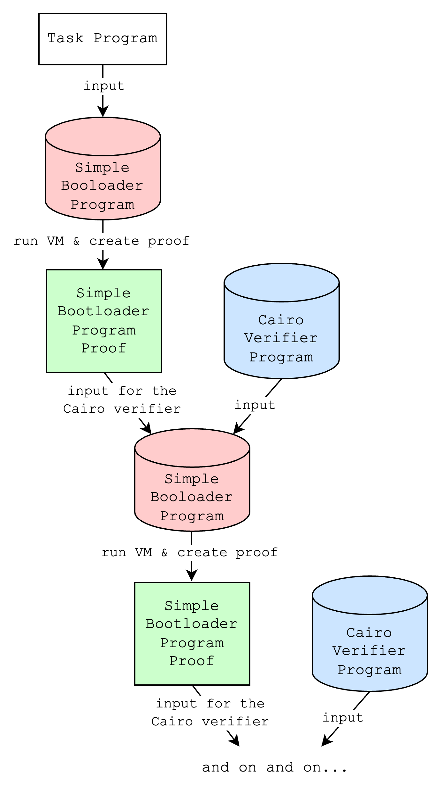
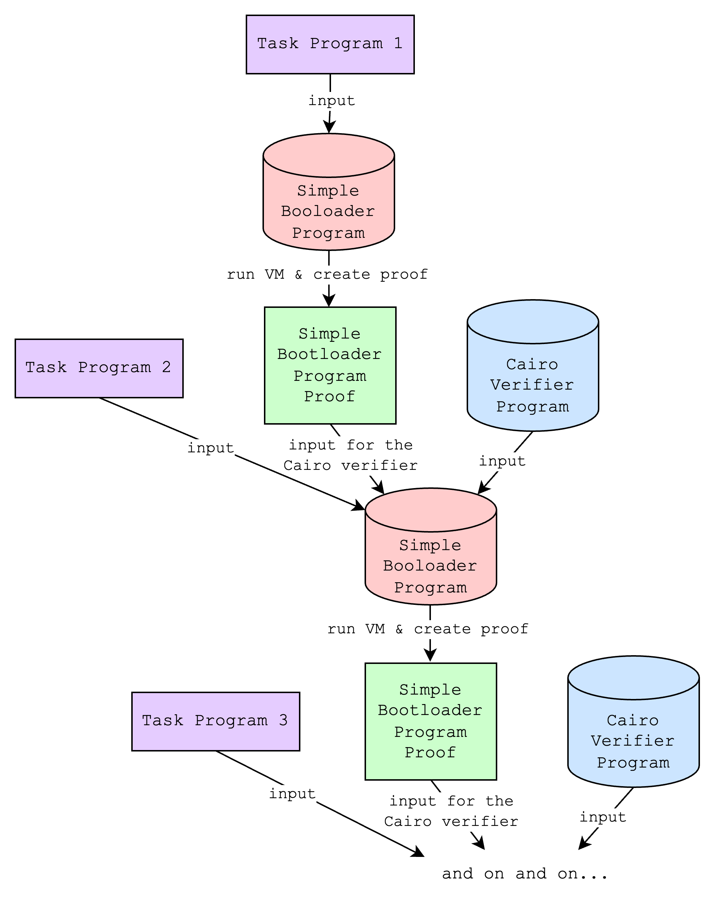
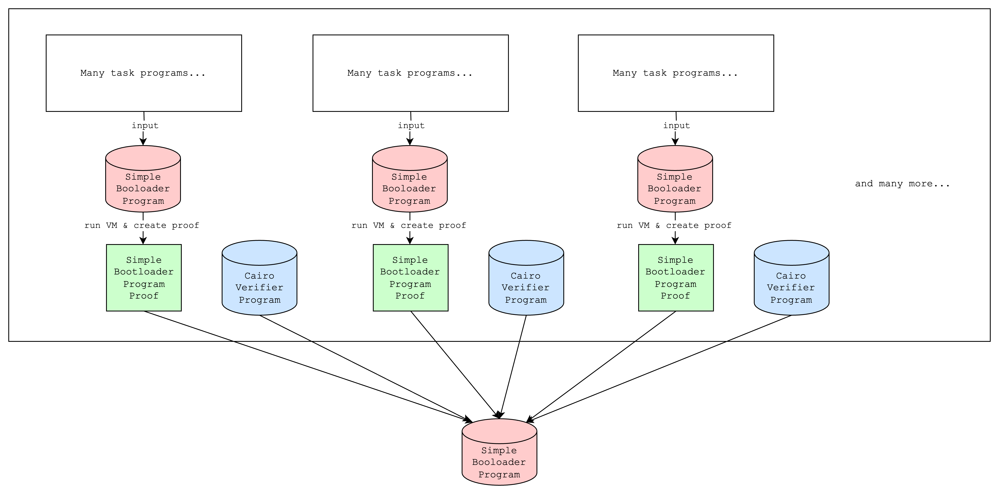
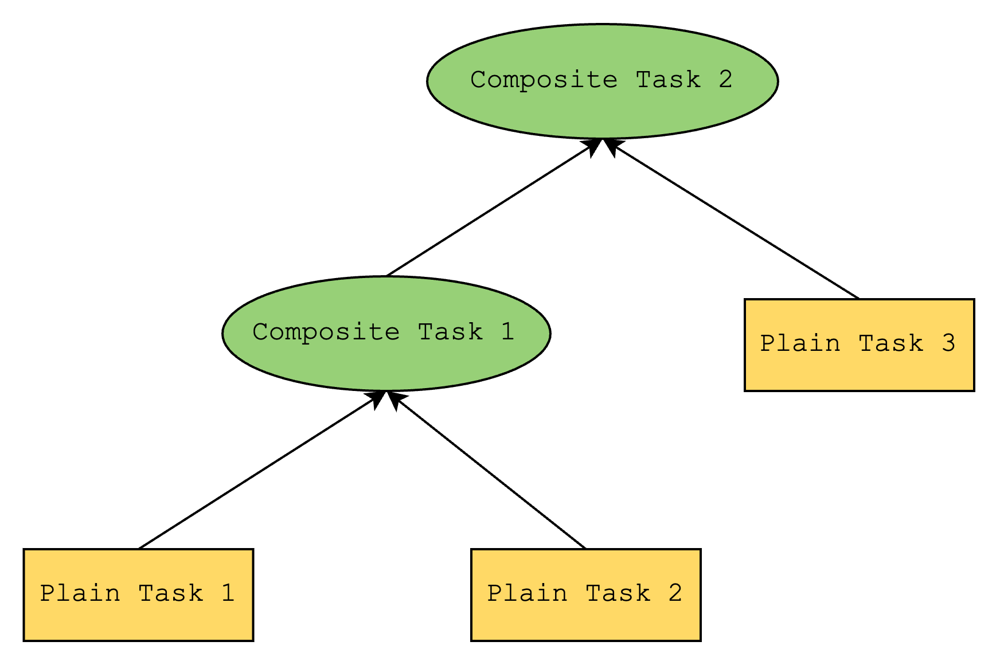
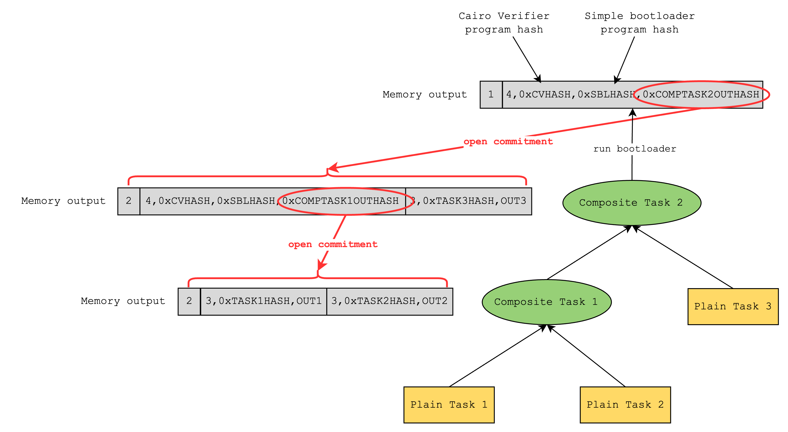
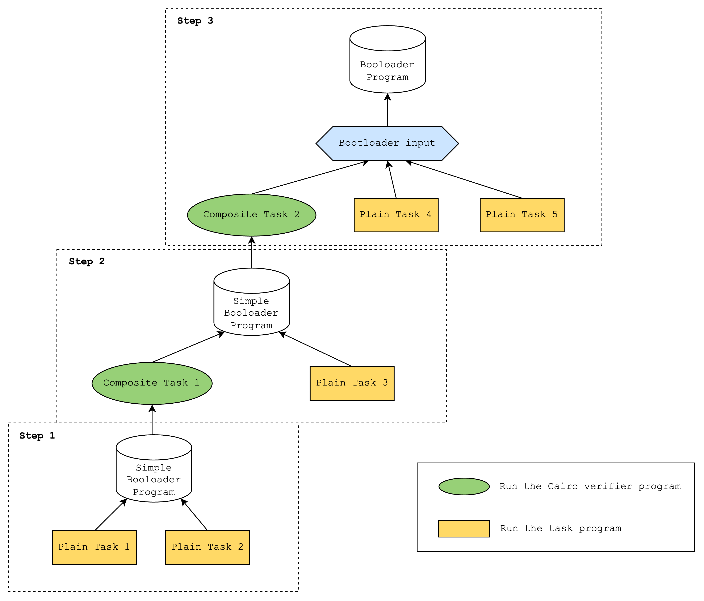

# Bootloader

The primary purpose of the bootloader is to reduce the size of the public inputs, which includes the instructions of the program that is being proven. Since this can become a bottleneck once a program becomes big enough, the idea is to create a program of constant size that executes the big program and outputs only the hash of its instructions, which can be externally verified. Using the bootloader, we can also do the following: 1. sequentially run multiple programs, and 2. recursively verify bootloader proofs inside the bootloader.

Note: this doc is based on the [Cairo v0.13.1 version of the bootloader](https://github.com/starkware-libs/cairo-lang/tree/v0.13.1/src/starkware/cairo/bootloaders)

Please refer to the [CairoVM doc](./cairo_vm.md) for an overview of how CairoVM works.

## How the "simple bootloader" works

Here is a pseudocode of how the simple bootloader works on a high level:

```
function run_simple_bootloader(tasks):
    load_bootloader_instructions()
    write_to_output(len(tasks))

    for task in tasks:
        load_task_instructions(task)
        hash = compute_task_instructions_hash(task)
        write_to_output(hash)

        builtin_pointers = get_required_builtin_allocators(task)
        task_outputs = run_task(task, builtin_pointers)
        write_to_output(task_outputs)

        for pointer in builtin_pointers:
            validate_allocator_advancement(pointer)

function validate_allocator_advancement(pointer):
    advancement = pointer.current_pointer - pointer.initial_pointer
    assert advancement >= 0 and advancement % pointer.cells_per_use == 0

```

Running the bootloader program (as running any Cairo program) will result in a memory vector and an execution trace. But since the bootloader program runs Cairo programs inside it, the generated memory and execution trace should include those of the Cairo programs as well. Below is an example of what the memory layout looks like after running the bootloader:

<div style="text-align: center;">
    
</div>

(Note: a **task** here refers to a single Cairo program and its inputs)

In other words, what the bootloader program does is it makes sure that the inner Cairo programs can write to various segments in the memory without any conflicts with each other or with the outer bootloader program. It also hashes the instructions of each inner Cairo program and writes the hashes to the output.

This is a "simple" use of the bootloader and we can use this functionality using the `simple_bootloader.cairo` file ([link](https://github.com/starkware-libs/cairo-lang/blob/v0.13.1/src/starkware/cairo/bootloaders/simple_bootloader/simple_bootloader.cairo)) in the Cairo repo. We will discuss an "advanced" use of the bootloader in the [How the "advanced" bootloader works](#how-the-advanced-bootloader-works) section.

### Some more details on how the "simple" bootloader works

#### What builtins does the bootloader use?

- output
  - used to write the number of tasks and sequentially write the output related to each task
- pedersen
  - used to hash the task program bytecode
- range checks

  - used to check that each task program used the builtins correctly.
  - Each builtin has a different amounts of memory cell usage

    ```
      output=1,
      pedersen=3,
      range_check=1,
      ecdsa=2,
      bitwise=5,
      ec_op=7,
      keccak=16,
      poseidon=6,
    ```

  - So for example, since the pedersen builtin requires 3 cells (2 for inputs, 1 for output), the bootloader checks that the difference between the pedersen builtin pointer before and after the task program run is positive (this is where the range check comes in) and that it is divisible by 3.

#### How are task program bytecode loaded into memory?

The bootloader creates a separate segment in the memory for storing each task program bytecode

#### How are task outputs written to memory?

The bootloader writes the task outputs sequentially (i.e. in the order that the task programs are run) to the output builtin segment. Below is an example of what this looks like:

<div style="text-align: center;">
    
</div>

#### How do task programs use builtins other than the output builtin?

- assuming that the selected layout supports the builtins that the task program uses, the bootloader will pass the necessary builtin pointers to the task program's main function, and the task program will use builtin cells as needed and return the pointers to the next unused builtin cells.
- at the end of the task program run, the bootloader will validate that the builtin pointers have been correctly advanced, as explained in the [What builtins does the bootloader use?](#what-builtins-does-the-bootloader-use) section.

#### How are task program hints handled?

- As mentioned in the [A short primer on how the CairoVM works](#a-short-primer-on-how-cairovm-works) section, hints are specified to run before a certain bytecode is executed. In CairoVM, that refers the the “pc” value, or the program counter, and this value is normally a value in Segment 0. So a typical hint should run before, say when pc=(Segment 0, Index 15).
- However, task program bytecode are loaded into a separate segment (e.g. Segment 11), so the pc values for the hints of the task program need to updated accordingly.

## How the "advanced" bootloader works

The "advanced" bootloader builds upon the "simple" bootloader by allowing as input not just Cairo programs but also a structured set of inputs that include both Cairo programs and simple bootloader proofs. In this section, we will go over how this works in multiple steps.

(The "advanced" bootloader refers to the `bootloader.cairo` file ([link](https://github.com/starkware-libs/cairo-lang/blob/v0.13.1/src/starkware/cairo/bootloaders/bootloader/bootloader.cairo)) in the Cairo repo.)

### Step 1: A Cairo verifier program

First, we need to understand what a Cairo verifier program is.

A Cairo verifier is a Cairo program that verifies a Cairo proof, and in this case, it will only verify a proof generated using the "simple" bootloader. Below is an example of what running a Cairo verifier program looks like.

<div style="text-align: center;">
    
</div>

Note that when the Cairo verifier verifies the simple bootloader proof, it includes in the output the hash of the simple bootloader program and the hash of the outputs of the simple bootloader. This means that it is possible to commit to the output of the simple bootloader using the Cairo verifier and open it later.

### Step 2: Iteratively creating proofs

Looking closely at diagram above, you can see that we can tweak it a little bit to create a perfect loop. Since the simple bootloader can run any arbitrary program and the Cairo verifier requires a proof of the simple bootloader, we can do something like the following:

<div style="text-align: center;">
    
</div>

Of course, there is no point in just repeating this loop, but if we tweak this just a little bit again, we can do something more interesting: creating a proof that both verifies an existing proof and proves a new program. We'll call this "iteratively creating proofs", which is the core of what the "advanced" bootloader does.

<div style="text-align: center;">
    
</div>

This might still not seem too useful, but it unlocks a new use case for users who want to create proofs of programs as they come, not just when they have a fixed set. For example, L2 nodes that need to create a single proof of programs that are transmitted over a 15-minute period do not need to wait for the whole 15 minutes and create a proof at the last minute, which would take a long time if the number of programs to be proven are large. Instead, they can create a proof after the first 1 minute, and for the next 14 times every minute they can create a new proof that recursively proves the previous proof and proves the new programs.

We can also simply run multiple simple bootloaders on separate programs and aggregate the proofs with a single additional simple bootloader execution. This can have the following benefits:

- improve proving time if multiple simple bootloaders are run in parallel
- avoid memory limits from proving too many programs at once

<div style="text-align: center;">
    
</div>

### Step 3: Verifying iteratively created proofs

At the end of the iterations, we will have a simple bootloader program proof but its output will be a hash of the outputs of the previous iteration (as mentioned in [Step 1](#step-1-a-cairo-verifier-program)). We can view this as a tree where the output of the final iteration is the root.

<div style="text-align: center;">
    
</div>

So the tree will look something like the above, where a **plain task** represents a Cairo program and a **composite task** represents a Cairo verifier program. Here, Composite Task 2 represents the root of the tree, and it contains the hash of the outputs of Composite Task 1 and Plain Task 3.

Unfortunately, the simple bootloader does not have a way to verify that this root is correct, and this is where the "advanced" bootloader steps in. The "advanced" bootloader verifies the root by doing a depth-first search and verifying that all internal nodes (i.e. composite tasks) correctly hash the outputs of its children.

<div style="text-align: center;">
    
</div>

After verification, the advanced bootloader now knows all the leaf data of the tree, so it can write to the output the entire set of task program outputs that have been proven throughout the iterations. This way, anyone looking at the bootloader output can check that a certain Cairo program has a certain output.

<div style="text-align: center;">
    
</div>

Bringing it all together, this is what a sample bootloader run looks like:

1. Run simple bootloader that runs Plain Task 1 and Plain Task 2
2. Run simple bootloader that runs Composite Task 1 and Plain Task 3
3. Run advanced bootloader that runs Composite Task 2 and Plain Task 4 and Plain Task 5

In step 3, the outputs of Plain Tasks 1, 2, and 3 will need to be provided as hints to the advanced bootloader.

<div style="text-align: center;">
    
</div>
