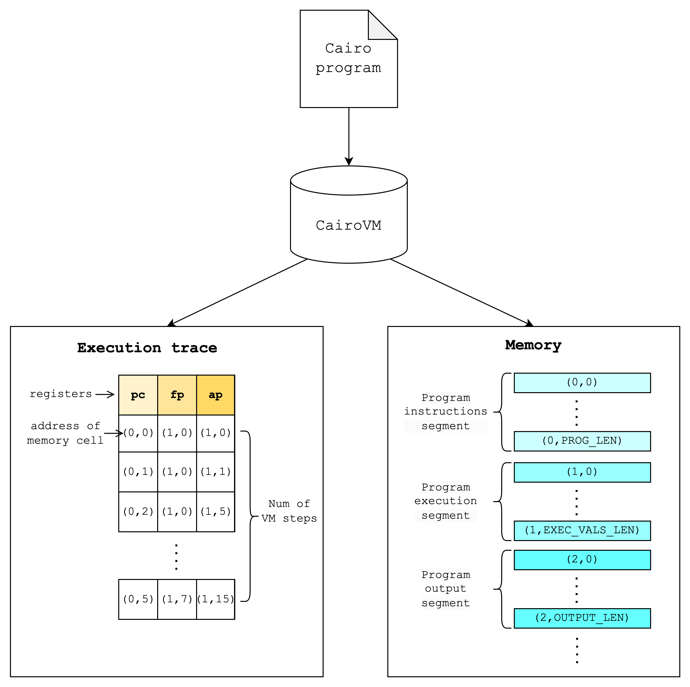

# CairoVM

Cairo compiles down to CairoVM and in the end produce a memory vector and execution trace table that is populated throughout the execution of the program.

More specifically, the fully assigned memory can be thought of as a vector that is divided into segments that have different functionalities (e.g. program instructions, execution, output). The execution trace is a table with 3 columns each representing a register value and rows that each represent the value of the registers over the execution of the program.

<div style="text-align: center;">
    
</div>

Note: the execution segment can be thought of as values that are written to the memory when running a program. Since the memory values can only be written once in CairoVM, Cairo programs keep track of the next available memory cell with a "allocation pointer" register (similar to a bump allocator in conventional terms).

Using these results of the CairoVM execution, the Stone prover can create a proof that proves the following (very roughly speaking):

- there exists a valid execution trace of n steps on the CairoVM
  - which starts with a given set of initial register values
  - which ends with a given set of final register values
  - for some memory which satisfies certain constraints (e.g. read-only, continuous, consistent with the public memory portion)

## Builtins

Builtins can be understood as memory-mapped peripherals, i.e. pre-allocated memory cells that can be used for certain commonly-used functions.

As of Cairo v0.13.1, these builtins are currently supported:

- Output
- Pedersen
- Range check (128 bits)
- Bitwise
- Elliptic curve operation
- Keccak
- Poseidon
- Range check (96 bits)

Each builtin is assigned a separate segment in the memory vector. The VM will write the builtin inputs to memory cells in the segment and retrieve the builtin outputs by reading memory cells from the segment.

For the range-check builtin, the CairoVM simply writes the value to be range checked into the next unused cell in the range-check segment. This segment guarantees that every memory cell in the range [X, Y).

For a Pedersen builtin, on the other hand, for each builtin use, you can input two values and read the next cell as output since the VM provides a guarantee that the next cell will contain the correct output (i.e. the Pedersen hash of the two input values).

<div style="text-align: center;">
    
</div>

In order to run a program that uses one of these builtins, we need to specify a specific layout to CairoVM that supports the builtins that the program uses. Below is a subset of layouts that are currently supported by the CairoVM. (Check this [code](https://github.com/lambdaclass/cairo-vm/blob/main/vm/src/types/instance_definitions/builtins_instance_def.rs) for the updated, comprehensive list)

|             | small | recursive | dex | recursive_with_poseidon | starknet | starknet_with_keccak |
| ----------- | :---: | :-------: | :-: | :---------------------: | :------: | :------------------: |
| output      |   O   |     O     |  O  |            O            |    O     |          O           |
| pedersen    |   O   |     O     |  O  |            O            |    O     |          O           |
| range_check |   O   |     O     |  O  |            O            |    O     |          O           |
| bitwise     |       |     O     |     |            O            |    O     |          O           |
| ecdsa       |       |           |  O  |                         |    O     |          O           |
| poseidon    |       |           |     |            O            |    O     |          O           |
| ec_op       |       |           |     |                         |    O     |          O           |
| keccak      |       |           |     |                         |          |          O           |

## Hints

Hints are non-deterministic computation (i.e. code that is run outside of the VM to populate values that are validated inside the VM)

For example, when computing the square root of an integer in a prime field, directly computing this using constraints is expensive. So instead, we can use hint to calculate the square root and create a constraint inside the VM that checks that the power of the given square root is equal to the original value.

So given a computation $x=\sqrt{y}$, compute $y$ using a hint and create a constraint: $y=x*x$

$x$ from the perspective of the VM is a wild guess, but the constraint makes sure that it’s valid.

In Cairo 0 language, you can run a hint by embedding a block of Python code. Below is an example of computing a square root of 25.

```python
[ap] = 25, ap++;
%{
    import math
    memory[ap] = int(math.sqrt(memory[ap - 1]))
%}
[ap - 1] = [ap] * [ap], ap++;
```

When compiling this Cairo 0 program into CASM, the compiler stores this Python code as a string and specifies that this hint should be run before running the ensuing instruction. In this case, the hint should be run before the `[ap - 1] = [ap] * [ap], ap++;` instruction.
